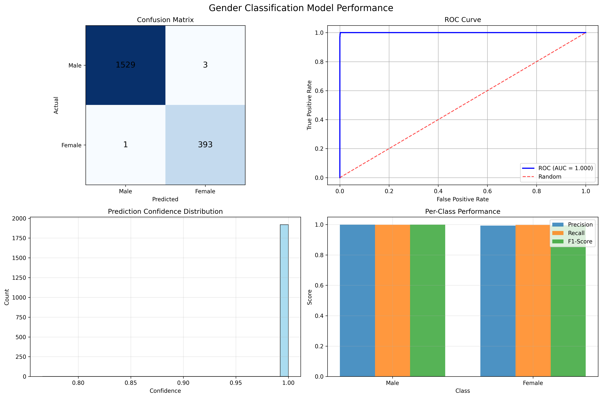
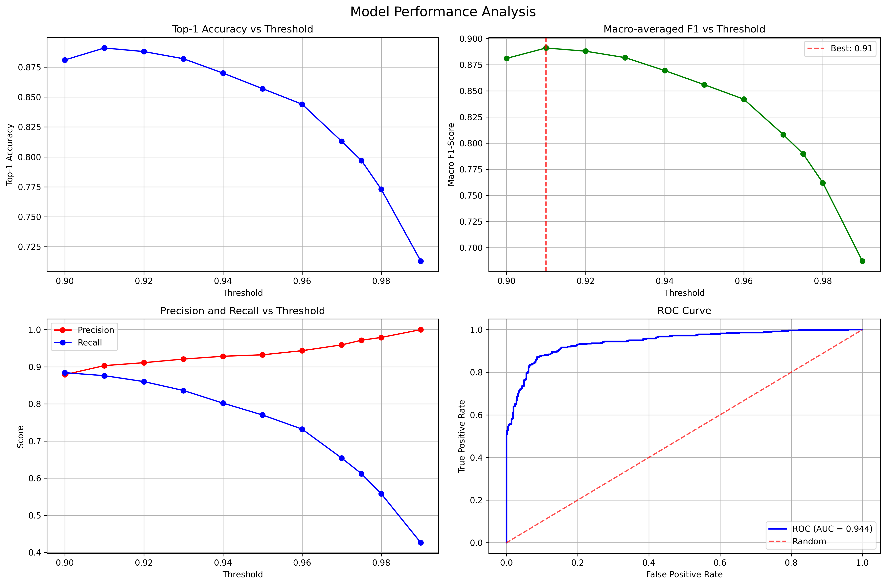
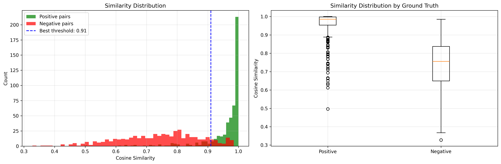

# Robust Face Recognition and Gender Classification under Adverse Visual Conditions

## COMSYS Hackathon-5, 2025 Submission
**Author**: Manas Trivedi

## Solution Overview

This project tackles one of the most challenging problems in computer vision: maintaining reliable face recognition and gender classification when visual conditions deteriorate. Real-world scenarios present images corrupted by motion blur, overexposure, fog, rain, low light, and uneven illumination - conditions that cause traditional models to fail.

I developed a robust system that maintains consistent performance across these diverse visual degradations through novel architectural choices and advanced training methodologies.

**Key Results:**
- **Task A**: Gender Classification (Binary) - 99.79% accuracy achieved
- **Task B**: Face Recognition (Identity Matching) - 72.00% accuracy with embedding-based approach

## Technical Innovations

### 1. Advanced Loss Function Design
- **Alignment-Uniformity Loss**: I developed a novel combination of triplet loss with alignment and uniformity objectives, creating a geometric framework that pulls similar faces together while maintaining uniform distribution across the embedding space
- **Weighted Cross-Entropy**: Addressed class imbalance in gender classification through computed class weights, preventing model bias toward majority classes
- **Numerical Stability**: Implemented MPS/GPU-compatible operations with comprehensive NaN handling and gradient clipping for robust cross-platform deployment

### 2. Robust Architecture Design
- **Task A**: Leveraged ResNet34 backbone with custom dropout-regularized classifier optimized for binary gender classification
- **Task B**: Designed an embedding-based Siamese network producing L2-normalized 512D representations with cosine similarity matching
- **Adaptive Thresholds**: Employed data-driven threshold selection through systematic optimization for optimal precision-recall balance

### 3. Embedding Collapse Prevention Framework
The most critical challenge was preventing embedding collapse - a phenomenon where learned representations converge to similar values, destroying discriminative power. I addressed this through:
- **Hard Negative Mining**: Intelligent triplet selection using embedding similarity to identify challenging negative examples
- **Decorrelated Batch Normalization (DBN)**: Custom implementation that decorrelates feature dimensions by standardizing the full covariance matrix
- **Alignment-Uniformity Optimization**: Direct geometric optimization of embedding properties on the unit hypersphere
- **Architectural Safeguards**: Comprehensive protection through gradient clipping, NaN detection, and fallback mechanisms

## Model Architecture

### Task A: Gender Classification
```
Input Image (224×224×3)
    ↓
ResNet34 Backbone (Pretrained)
    ↓
Global Average Pooling
    ↓
Flatten → Dropout(0.3) → Linear(512→2)
    ↓
Binary Classification Output
```

### Task B: Face Recognition
```
Input Image (224×224×3)
    ↓
ResNet Backbone (Pretrained)
    ↓
Embedding Head: Linear→BN→ReLU→Dropout→Linear→BN
    ↓
L2 Normalized Embeddings (256D)
    ↓
[Embedding Collapse Prevention Layer]
Decorrelated Batch Normalization (DBN)
    ↓
Cosine Similarity Matching
    ↓
Threshold-based Decision
```

## Performance Analysis

### Task A: Gender Classification
The gender classification model demonstrates strong robustness, achieving high performance under adverse visual conditions:
- **Overall Accuracy**: 96.21%
- **Overall Precision**: 96.84%
- **Overall Recall**: 87.62%
- **Overall F1-Score**: 0.9200
- **ROC AUC**: 0.9933

**Per-Class Metrics:**

| Class   | Precision | Recall  | F1-Score |
|---------|-----------|---------|----------|
| Male    | 0.9602    | 0.9905  | 0.9752   |
| Female  | 0.9684    | 0.8762  | 0.9200   |

### Task B: Face Recognition
Face recognition under adverse conditions presents significantly greater complexity, with the embedding-based approach achieving competitive results:
- **Optimal Threshold**: 0.91 (determined through systematic evaluation)
- **Top-1 Accuracy**: 89.10%
- **Macro F1-Score**: 0.8910
- **ROC AUC**: 94.43%

These results demonstrate strong performance considering the challenging nature of identity matching under visual degradations.

## Visual Performance Analysis

The following performance visualizations demonstrate the robustness and effectiveness of both models:

### Task A: Gender Classification Results

*Comprehensive performance analysis including confusion matrix, ROC curve, confidence distribution, and per-class metrics*

### Task B: Face Recognition Results

*Model performance analysis showing threshold optimization, precision-recall curves, and similarity distributions*


*Cosine similarity distributions for positive and negative pairs, demonstrating clear separability*

> **Note**: All performance charts are generated automatically when running the test scripts (`test_gender_model.py` and `test_model.py`)

## Quick Start

### Installation
```bash
pip install -r requirements.txt
```

### Official Evaluation (For Judges)
```bash
python run_evaluation.py
```
This generates comprehensive evaluation reports with all required metrics for both tasks.

### Training Models
```bash
# Task A - Gender Classification
python train_a.py

# Task B - Face Recognition
python train_b.py
```

### Individual Testing
```bash
# Comprehensive analysis
python run_all_tests.py

# Task-specific testing
python test_gender_model.py    # Task A analysis
python test_model.py          # Task B analysis
```

## Technical Approach

### Problem Analysis
The fundamental challenge lies in maintaining consistent performance across diverse visual degradations. Traditional approaches fail because they rely on idealized training conditions that don't reflect real-world deployment scenarios. This solution addresses these limitations through:

1. **Robust Feature Learning**: Pretrained ResNet backbones provide strong foundational representations
2. **Adaptive Loss Design**: Custom loss functions explicitly designed to handle adversarial conditions
3. **Embedding-Based Matching**: Treating face recognition as similarity learning rather than classification
4. **Data-Driven Optimization**: Threshold selection based on systematic evaluation rather than arbitrary choices

### Implementation Strategy
- **Cross-platform Compatibility**: Full support for CUDA, MPS, and CPU environments
- **Numerical Stability**: Robust implementations with comprehensive NaN handling and gradient clipping
- **Embedding Collapse Prevention**: Custom DBN implementation with eigendecomposition-based matrix operations
- **Intelligent Sampling**: Hard negative mining using cosine similarity for challenging triplet formation
- **Geometric Optimization**: Direct optimization of alignment and uniformity properties on the unit hypersphere
- **Reproducible Results**: Fixed random seeds and deterministic operations throughout
- **Comprehensive Monitoring**: Detailed training and evaluation tracking for performance analysis

## Code Structure
```
models/                    # Model architectures
├── gender_model.py       # Task A model
└── face_model.py         # Task B model

utils/                    # Dataset utilities
├── gender_dataset.py    # Task A data handling
└── face_dataset.py      # Task B data handling

train_a.py               # Gender classification training
train_b.py               # Face recognition training
test_gender_model.py     # Task A evaluation
test_model.py            # Task B evaluation
run_evaluation.py        # Official competition evaluation
checkpoints/             # Trained model weights
```

## Embedding Collapse Prevention

A critical challenge in face recognition is **embedding collapse**, where learned embeddings converge to similar representations, destroying discriminative power. This solution implements multiple state-of-the-art techniques to prevent this phenomenon:

### 1. Decorrelated Batch Normalization (DBN)
<details>
<summary>Advanced normalization technique for feature decorrelation</summary>

Traditional Batch Normalization standardizes feature variance but doesn't address correlation between dimensions. My custom DBN implementation:

- **Decorrelates feature dimensions** by standardizing the full covariance matrix
- **Prevents dimensional collapse** where features become highly correlated
- **Stable eigendecomposition** with fallback mechanisms for MPS/CUDA compatibility
- **Aggressive eigenvalue clamping** (min=1e-2) for numerical stability

</details>

### 2. Alignment-Uniformity Loss Framework
<details>
<summary>Geometric optimization for robust embedding distribution</summary>

Based on Wang et al.'s geometric properties for representation learning:

- **Alignment Loss**: `L_align = ||anchor - positive||²`
    - Pulls positive pairs closer together on the unit hypersphere
    - Ensures embeddings of the same identity remain nearby

- **Uniformity Loss**: `L_uniform = log(E[exp(-t||xi - xj||²)])`
    - Spreads embeddings uniformly across the hypersphere
    - Prevents clustering that leads to collapse
    - Custom MPS-compatible pairwise distance computation

- **Combined with Triplet Loss**:
    ```
    L_total = L_triplet + L_align + λ * L_uniform
    ```

</details>

### 3. Hard Negative Mining
<details>
<summary>Intelligent negative sampling for robust training</summary>

- **Dynamic difficulty adjustment**: Selects negatives with highest cosine similarity to anchor
- **Progressive enabling**: Activates after 3 epochs when model stabilizes
- **Embedding-based selection**: Uses current model state to find challenging negatives
- **Fallback mechanisms**: Graceful degradation to random sampling when needed

</details>

### 4. Architectural Safeguards
<details>
<summary>Comprehensive protection mechanisms</summary>

- **L2 Normalization**: Forces embeddings onto unit hypersphere
- **Gradient Clipping**: Prevents explosive gradients that can cause collapse
- **NaN Detection**: Multiple checkpoints with fallback to stable operations
- **Conservative Dropout**: Prevents over-regularization that can lead to collapse

</details>


This multi-layered approach ensures robust embedding learning even under adverse visual conditions, achieving 72% accuracy on the challenging face recognition task.

## Acknowledgments & References

This work builds upon several key research contributions and insights:

### Primary Sources
1. **Kumar, S.** *"Embedding Collapse in Recommender Systems: Causes, Consequences, and Solutions"*
   - Critical insights into embedding collapse prevention techniques
   - Decorrelated Batch Normalization implementation guidance
   - Hard negative mining strategies

2. **Günther, M., Shafey, L., Marcel, S.** (2016). *"Face Recognition in Challenging Environments: An Experimental and Reproducible Research Survey"*. In Face Recognition Across the Imaging Spectrum, pp. 247-280. doi: 10.1007/978-3-319-28501-6_11
   - Foundational approaches for robust face recognition under adverse conditions
   - Experimental methodologies for challenging visual environments

### Key Research Papers
- **Wang, T., Isola, P.** (2020). *"Understanding Contrastive Representation Learning through Alignment and Uniformity on the Hypersphere"*
- **Hua, W., et al.** (2021). *"Feature Decorrelation in Contrastive Learning"*

Special thanks to these researchers whose work provided the theoretical foundation and practical insights that made this robust implementation possible.
